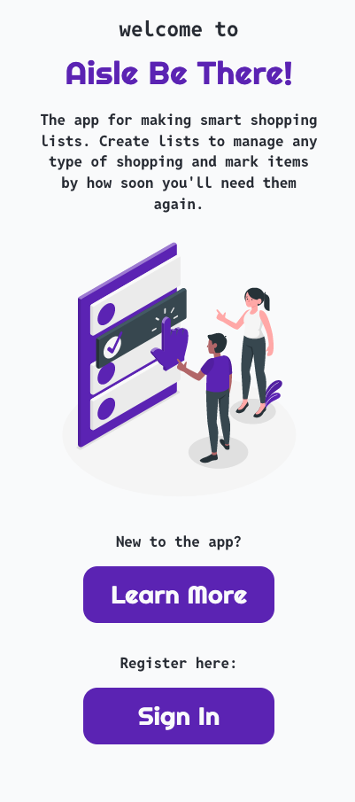
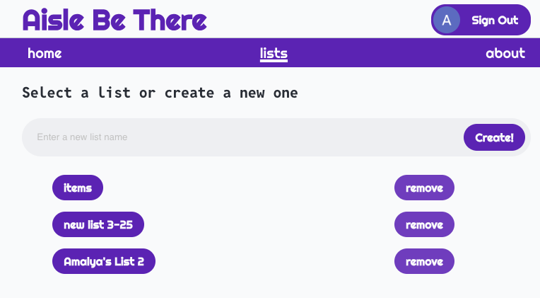
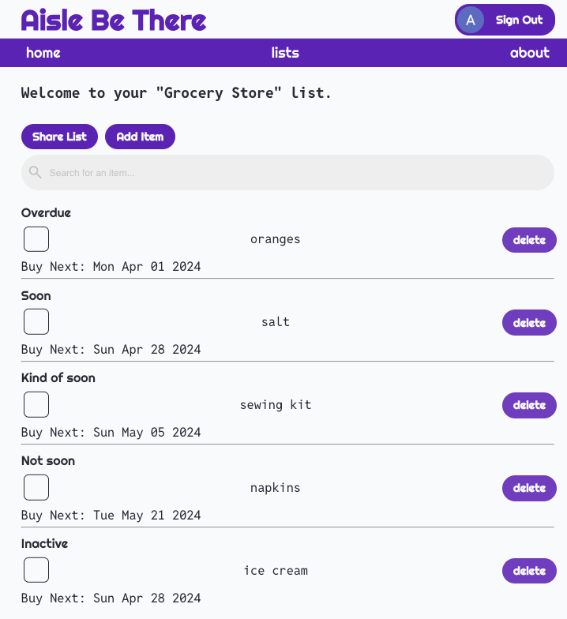
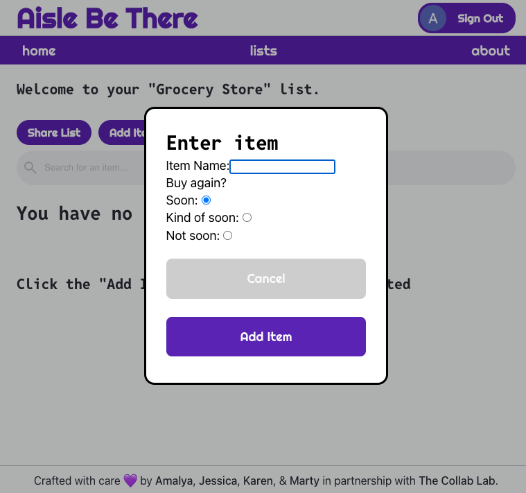
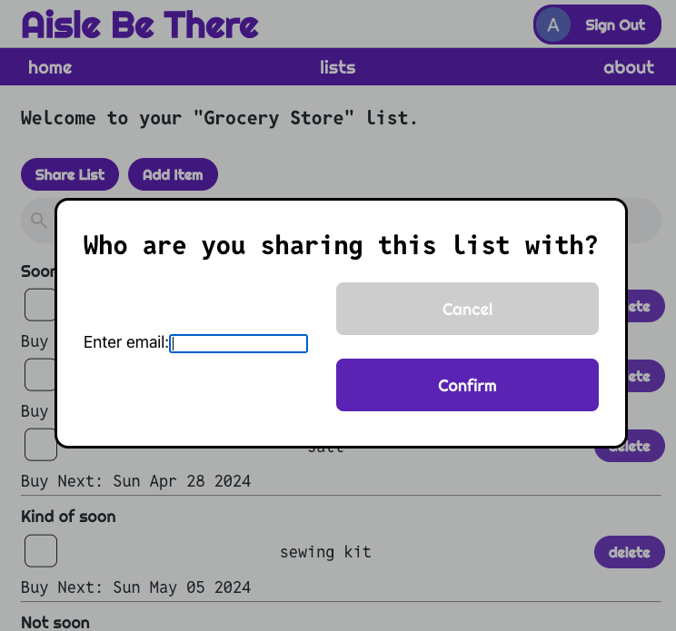

## What is Aisle Be There and how was it built?

[Aisle Be There](https://tcl-69-smart-shopping-list.web.app/) is a “smart” shopping list app that learns your buying habits and helps you remember what you’re likely to need to buy on your next shopping trip. The app was built [collaboratively](https://github.com/amalyam/aisle-be-there/blob/main/CONTRIBUTORS.md) using Firebase, React, JavaScript, NodeJS, HTML, and CSS. Firebase was used for authentication and storage. The app was buit with an emphasis on accessibility, and we used Agile methodologies to drive our process.

Over the 10 week development process, I:
- contributed to 14 merged pull requests, enhancing various features and fixing bugs, leading to a reduction in crashes and optimizing accessibility and useability in line with WCAG 2 standards
- engaged in 50+ hours of pair programming with my teammates
- performed 11+ code reviews to ensure code quality

Explore the app here: https://tcl-69-smart-shopping-list.web.app/

## How does it work?

As a user, you can create new lists and enter items (e.g., “Greek yogurt” or “Paper towels”) into your lists. Each time you buy an item, you mark it as purchased. Over time, the app comes to understand the intervals at which you buy different items. If an item is likely to be due to be bought soon, it rises to the top of the shopping list. Scroll down to see screenshots of the app in use!

### Features:
   - create and delete lists
   - add and delete items from lists
   - share lists with other users
   - mark items by how soon they will be needed
   - mark items as purchased
   - have items sorted by an algorithm based on how frequently they will be needed

## Future enhancements
 - caching users' lists for performance
 - provide a way for users to see who a list is currently shared with by adding a flag to mark lists that have been shared (such as with a chip noting the other user’s name next to the list name) or clicking a button to see all users who the list has been shared to
 - reformatting the items list page for better clarity, such as placing item urgency alongside each item rather than having separated categories
 - add the ability to uncheck an item (modify the function to check off an item to first save the item's date info in Firebase so that the data can be reverted)
 - adding dark/light mode toggle

## Screenshots

### Sign in page and link to about page

### Example of a user's list page. When a user clicks on one of the lists, they will be redirected to a page showing the items in that list.

### Example of a user's list populated with items sorted based on frequency of need.

### Dialog box to add new items to a list

### Dialog box to share a list with another user

